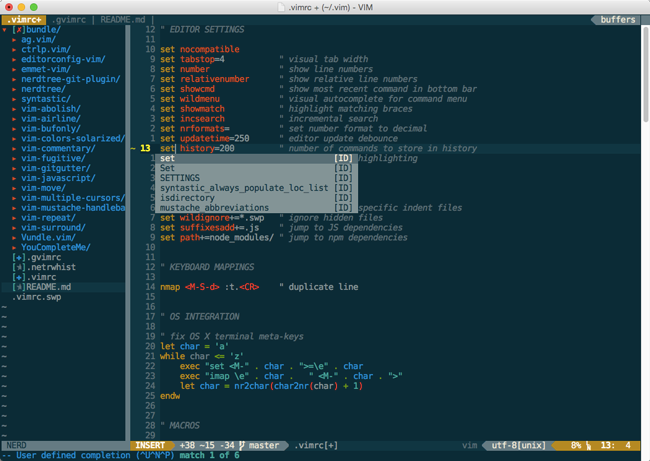

# vim-quickstart

> Sensible defaults for Vim newcomers



## Background

This setup is aimed towards recent Vim converts. It provides an opinionated Vim configuration that comes loaded with all the key features that are typically bundled with a modern editor, while exposing the underlying power of Vim.

In other words, you'll still have to learn Vim, but at least you'll have all the tools you'd expect from a fully-fledged code editor.


## Installation

These instructions should be everything you need to get up and running, starting from a clean OS install.

### Mac OS X

#### Option 1: Quick installation

1. Install [Homebrew](http://brew.sh)

2. Paste the following script into a terminal:

	```bash
	bash -c "$(curl -fsSL https://raw.githubusercontent.com/timkendrick/vim-quickstart/master/install/macosx.sh)"
	```

3. Install [MacVim](https://github.com/macvim-dev/macvim/releases)


#### Option 2: Manual installation

1. Install [Homebrew](http://brew.sh)

2. Install the quickstart bundle and add it to your Vim setup:

	```bash
	git clone https://github.com/timkendrick/vim-quickstart.git /.vim/bundle/vim-quickstart
	echo "set runtimepath+=~/.vim/bundle/vim-quickstart" >> ~/.vimrc
	echo "quickstart#init()" >> ~/.vimrc
	```

3. Install the [Vundle](https://github.com/VundleVim/Vundle.vim) package manager (used to install Vim plugins):

	```bash
	git clone https://github.com/VundleVim/Vundle.vim.git ~/.vim/bundle/Vundle.vim
	```
4. Install Vundle plugins:

	```bash
	vim -c QuickstartInstall -c '!~/.vim/bundle/YouCompleteMe/install.py' -c qa
	```

5. Install additional binaries:

	```bash
	brew install caskroom/cask/brew-cask editorconfig the_silver_searcher
	brew tap caskroom/fonts
	brew cask install font-dejavu-sans-mono-for-powerline
	```

5. Install [MacVim](https://github.com/macvim-dev/macvim/releases) (optional, but recommended)


#### Mac OS X Installation notes

When launching Vim via Terminal.app, make sure **Terminal > Preferences > Profiles > Keyboard > Use Option as Meta key** is selected to enable all keyboard shortcuts.


## User guide

### Terminal mode vs GUI mode

With the vim-quickstart setup, Vim will run in one of two different modes depending on the launch environment:

- When launched in a terminal shell, Vim will run in **Terminal mode**. This loads a minimal set of plugins, which can be useful for fast editing of individual files.
- When launched in a GUI (e.g. MacVim or GVim), Vim will run in **GUI mode**. This loads a richer set of plugins for a more IDE-like experience, which can be useful when working within larger projects.


### Included plugins

| Plugin | Terminal mode | GUI mode | Purpose |
| ------ | :-----------: | :------: | ------- |
| [unimpaired.vim](https://github.com/tpope/vim-unimpaired) | ✔︎ | ✔︎ | Paired action mappings |
| [surround.vim](https://github.com/tpope/vim-surround) | ✔︎ | ✔︎ | Wrap code blocks |
| [commentary.vim](https://github.com/tpope/vim-commentary) | ✔︎ | ✔︎ | Code commenting |
| [abolish.vim](https://github.com/tpope/vim-abolish) | ✔︎ | ✔︎ | Smart word substitution |
| [repeat.vim](https://github.com/tpope/vim-repeat) | ✔︎ | ✔︎ | Repeat complex actions |
| [vim-multiple-cursors](https://github.com/terryma/vim-multiple-cursors) | ✔︎ | ✔︎ | Sublime-style multiple cursors |
| [vim-expand-region](https://github.com/terryma/vim-expand-region) | ✔︎ | ✔︎ | Expand selection to parent block |
| [vim-textobj-user](https://github.com/kana/vim-textobj-user) | ✔︎ | ✔︎ | Custom text objects |
| [vim-textobj-lastpat](https://github.com/kana/vim-textobj-lastpat) | ✔︎ | ✔︎ | 'Last search pattern' text object |
| [vim-indent](https://github.com/timkendrick/vim-indent) | ✔︎ | ✔︎ | Convert between tabs and spaces |
| [DetectIndent](https://github.com/roryokane/detectindent) | ✔︎ | ✔︎ | Automatic indentation detection |
| [emmet-vim](https://github.com/mattn/emmet-vim) | ✔︎ | ✔︎ | Dynamic HTML snippets |
| [NERDTree](https://github.com/scrooloose/nerdtree) | | ✔︎ | File explorer sidebar |
| [nerdtree-git-plugin](https://github.com/Xuyuanp/nerdtree-git-plugin) | | ✔︎ | Git status in file explorer |
| [vim-gitgutter](https://github.com/airblade/vim-gitgutter) | | ✔︎ | Git status in gutter |
| [vim-airline](https://github.com/bling/vim-airline) | | ✔︎ | Improved status bar |
| [YouCompleteMe](https://github.com/Valloric/YouCompleteMe) | | ✔︎ | Code completion |
| [Syntastic](https://github.com/scrooloose/syntastic) | | ✔︎ | Syntax checking |
| [incsearch.vim](https://github.com/haya14busa/incsearch.vim) | | ✔︎ | Improved incremental search |
| [EditorConfig](https://github.com/editorconfig/editorconfig-vim) | | ✔︎ | [Editorconfig](http://editorconfig.org/) support |
| [ag.vim](https://github.com/rking/ag.vim) | | ✔︎ | Fast code search |
| [fugitive.vim](https://github.com/tpope/vim-fugitive) | | ✔︎ | Git repository actions |
| [vim-bufonly](https://github.com/schickling/vim-bufonly) | | ✔︎ | Allow closing all inactive buffers |
| [vim-colors-solarized](https://github.com/altercation/vim-colors-solarized) | | ✔︎ | [Solarized](http://ethanschoonover.com/solarized) color scheme |


### Included macros

| Macro | Terminal mode | GUI mode | Purpose |
| ----- | :-----------: | :------: | ------- |
| Matchit | ✔︎ | ✔︎ | Jump to block start/end |


### Keyboard mappings

| Keyboard shortcut | Action | Terminal mode | GUI mode |
| ----------------- | ------ | :-----------: | :------: |
| <kbd>Alt</kbd>+<kbd>v</kbd> | Paste from system clipboard | ✔︎ | ✔︎ |
| <kbd>Alt</kbd>+<kbd>e</kbd> | Use current word/selection for search | ✔︎ | ✔︎ |
| <kbd>Alt</kbd>+<kbd>Shift</kbd>+<kbd>d</kbd> | Duplicate line | ✔︎ | ✔︎ |
| <kbd>Alt</kbd>+<kbd>o</kbd> | Insert new line below cursor | ✔︎ | ✔︎ |
| <kbd>Alt</kbd>+<kbd>Shift</kbd>+<kbd>o</kbd> | Insert new line above cursor | ✔︎ | ✔︎ |
| <kbd>Alt</kbd>+<kbd>j</kbd> | Move line down | ✔︎ | ✔︎ |
| <kbd>Alt</kbd>+<kbd>k</kbd> | Move line up | ✔︎ | ✔︎ |
| <kbd>Alt</kbd>+<kbd>t</kbd> | Create new buffer | | ✔︎ |
| <kbd>Alt</kbd>+<kbd>{</kbd> | Switch to previous buffer | | ✔︎ |
| <kbd>Alt</kbd>+<kbd>}</kbd> | Switch to next buffer | | ✔︎ |
| <kbd>Alt</kbd>+<kbd>w</kbd> | Close current buffer | | ✔︎ |
| <kbd>Alt</kbd>+<kbd>Shift</kbd>+<kbd>w</kbd> | Close all buffers except current buffer | | ✔︎ |
| <kbd>Alt</kbd>+<kbd>Shift</kbd>+<kbd>s</kbd> | Save all buffers | | ✔︎ |
| <kbd>Alt</kbd>+<kbd>Tab</kbd> | Toggle NERDTree sidebar | | ✔︎ |

See plugin documentation for additional keyboard mappings.


### Customizing your `.vimrc`

You can add your own custom configuration to your `.vimrc` file to customize your setup.

Note that any configuration added *before* the `quickstart#init()` call may be overridden by vim-quickstart, so it's recommended that you add your custom configuration *after* the `quickstart#init()` call.


#### Loading additional plugins

vim-quickstart uses [Vundle](https://github.com/VundleVim/Vundle.vim) to manage its plugins.

To load additional Vundle plugins, pass a list of plugin names to the `quickstart#init()` function in your `.vimrc`:

```vim
set runtimepath+=~/.vim/bundle/vim-quickstart
quickstart#init(['pangloss/vim-javascript', 'marijnh/tern_for_vim'])
```

...or on multiple lines:

```vim
set runtimepath+=~/.vim/bundle/vim-quickstart
quickstart#init([
\ 'pangloss/vim-javascript',
\ 'marijnh/tern_for_vim'
\ ])
```

In the examples above, Vundle will load the `vim-javascript` and `tern_for_vim` plugins in addition to the vim-quickstart plugins.
